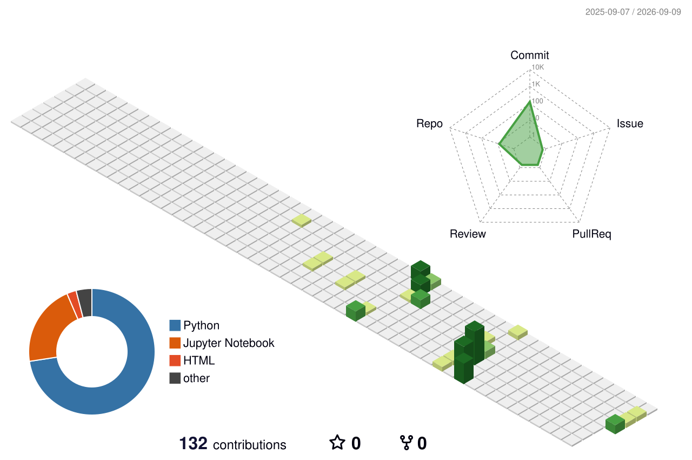

## Kuiyi (Cory) Gao

Evaluations and runtime defenses for AI agents.
B.A. Computer Science, UNC-Chapel Hill.

[Homepage](https://kuiyigao.github.io) · [Google Scholar](https://scholar.google.com/citations?user=Yobg_TQAAAAJ) · [CV](https://kuiyigao.github.io/Kuiyi_Gao_CV.pdf)

<!-- Theme options (swap the filename below): profile-green-animate · profile-green · profile-season-animate ·
     profile-season · profile-night-view · profile-night-green · profile-night-rainbow · profile-gitblock -->

### Publications

- **Can't See the Forest for the Trees: Benchmarking Multimodal Safety Awareness for Multimodal LLMs** — ACL 2025 (Main). [anthology](https://aclanthology.org/2025.acl-long.832/) · [arXiv](https://arxiv.org/abs/2502.11184)
- **Chain-of-Jailbreak Attack for Image Generation Models via Step by Step Editing** — Findings of ACL 2025. [anthology](https://aclanthology.org/2025.findings-acl.571/) · [arXiv](https://arxiv.org/abs/2410.03869)
- **A Dynamic Cross-Platform Benchmark for GUI-Agent Robustness under Real-World Interface Noise** — co-first author, under review, 2026.

### Repositories

| | |
|---|---|
| [OpenClaw-Skill-Hack](https://github.com/KuiyiGao/OpenClaw-Skill-Hack) | Agent Skill Firewall — runtime intent–action–result verification for agent skills |
| [Distorted-OCR-Compression](https://github.com/KuiyiGao/Distorted-OCR-Compression) | MemSlot saliency + OCR compression for long documents |
| [QuickMotionDetection](https://github.com/KuiyiGao/QuickMotionDetection) | Movability segmentation, a perception prior for embodied safety |
