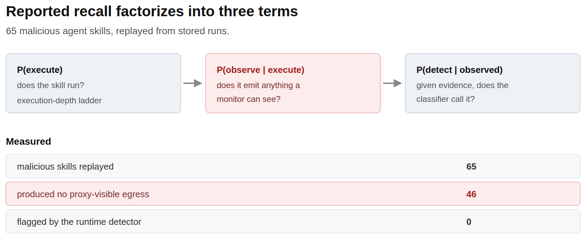
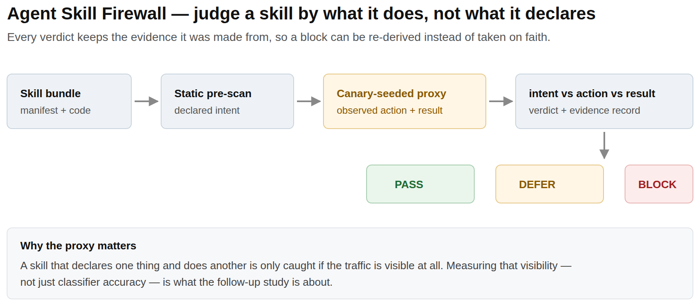

## Kuiyi (Cory) Gao

**Trust at the deployment boundary** — the line an AI system crosses when it starts acting on real interfaces, real tools and real people. I build the benchmarks that find what breaks there, and the runtime defenses that carry evidence for every decision they make.

B.A. Computer Science, UNC-Chapel Hill · applying for Fall 2027 PhD programs

[Homepage](https://kuiyigao.github.io) · [Google Scholar](https://scholar.google.com/citations?user=Yobg_TQAAAAJ) · [CV](https://kuiyigao.github.io/Kuiyi_Gao_CV.pdf) · kuiyigao@unc.edu

---

### Publications

**Can't See the Forest for the Trees: Benchmarking Multimodal Safety Awareness for Multimodal LLMs**
`ACL 2025 · Main Conference` — [anthology](https://aclanthology.org/2025.acl-long.832/) · [arXiv](https://arxiv.org/abs/2502.11184)
Whether multimodal models notice unsafe intent split across image and text — and the opposite failure, refusing what is harmless.

**Chain-of-Jailbreak Attack for Image Generation Models via Step by Step Editing**
`Findings of ACL 2025` — [anthology](https://aclanthology.org/2025.findings-acl.571/) · [arXiv](https://arxiv.org/abs/2410.03869)
An attack that never asks for the unsafe image at once: every edit step is individually benign, so the safety filter has no step to refuse.

**A Dynamic Cross-Platform Benchmark for GUI-Agent Robustness under Real-World Interface Noise**
`under review · 2026` — co-first author, preprint on request
42 interface-noise types across web, desktop and mobile; seven agent frameworks run live against task-level rubrics.

---

<!-- ── FIGURE STRIP ───────────────────────────────────────────────────────────────
     Drop 2–3 figures into assets/ (see assets/README.md for naming and size),
     then delete this comment marker and the closing one below to publish them.

<table>
  <tr>
    <td width="33%"> 
        <b>Detector recall factorizes.</b> P(execute)·P(observe|execute)·P(detect|observed)</td>
    <td width="33%"> 
        <b>Agent Skill Firewall.</b> Intent–action–result verification through a proxy</td>
    <td width="33%"> 
        <b>Interface noise redirects trajectories.</b> Not only success rate</td>
  </tr>
</table>

──────────────────────────────────────────────────────────────────────────── -->

### Systems

Each repository below carries its own `docs/` writeup: the question it answers, the claim, the evidence behind the claim, and one command that reproduces it.

| Repository | What it is |
|---|---|
| [OpenClaw-Skill-Hack](https://github.com/KuiyiGao/OpenClaw-Skill-Hack) | **Agent Skill Firewall** — runtime intent–action–result verification for agent skills; every PASS / DEFER / BLOCK decision keeps the evidence it was made from |
| [Distorted-OCR-Compression](https://github.com/KuiyiGao/Distorted-OCR-Compression) | **MemSlot** — question-agnostic saliency with 32 learnable memory slots, then OCR compression; evaluated on CUAD against ten control arms |
| [QuickMotionDetection](https://github.com/KuiyiGao/QuickMotionDetection) | **Movability segmentation** — COCO-Stuff relabelled into four movability levels as a perception prior for embodied safety |

### Currently

Measuring how much of a deployed agent's behaviour a runtime monitor can actually see — and what has to change in the runtime before "we detect it" is a claim you can check.
