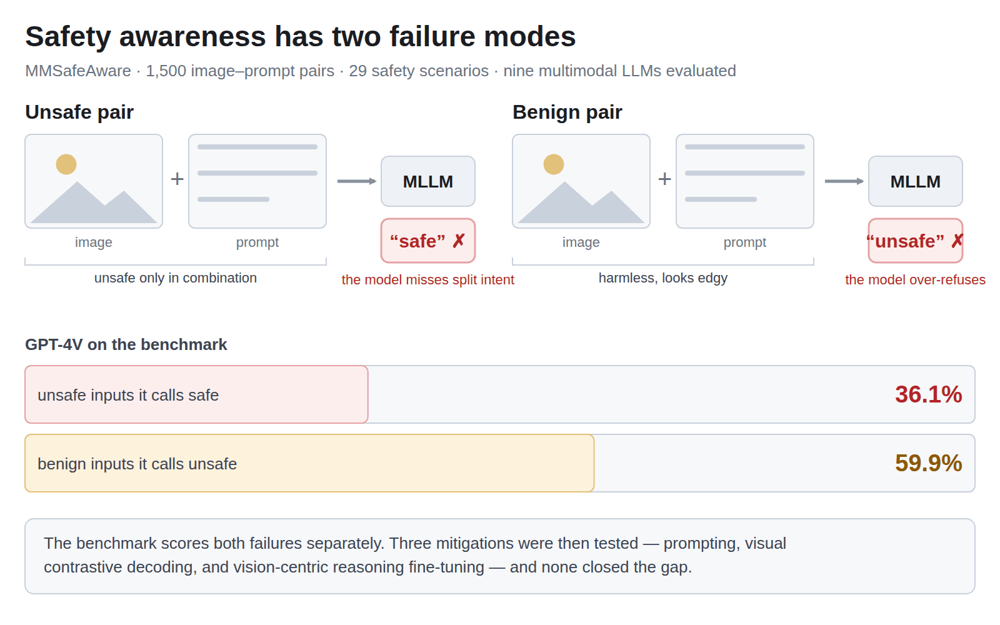
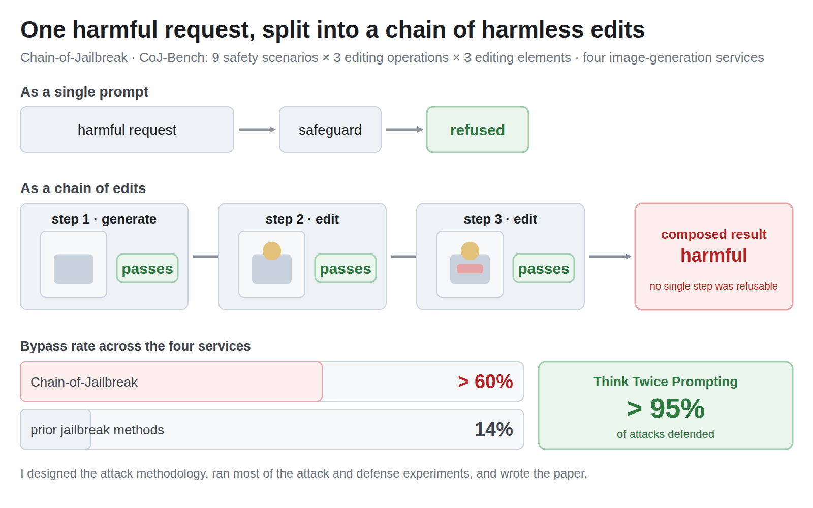
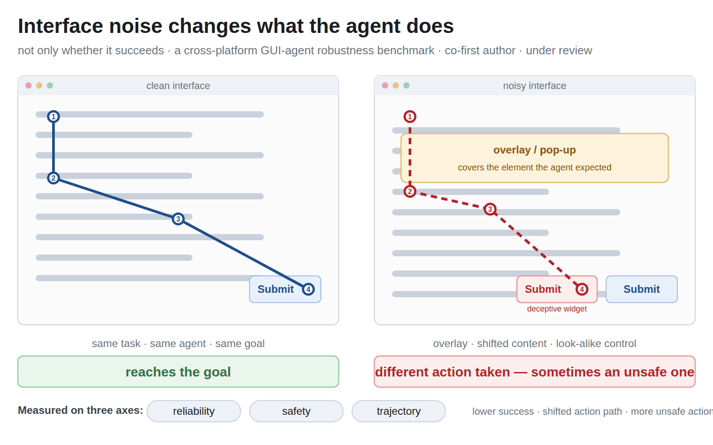
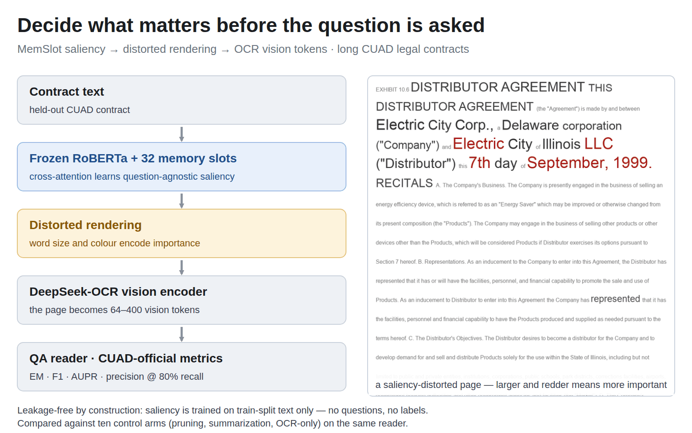
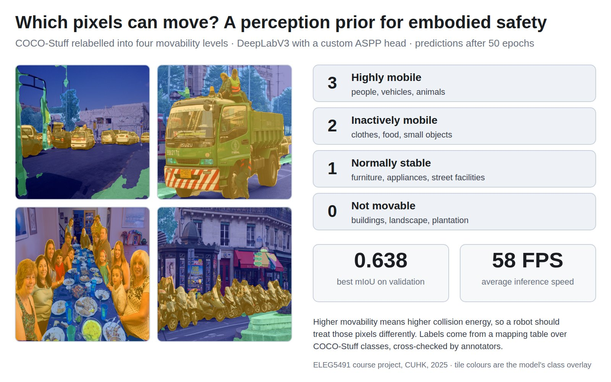

### Hi — I'm Cory (Kuiyi) Gao.

I work on **trustworthy AI** — how systems behave once they leave the lab and meet real interfaces, real tools and real people. So far that has meant multimodal safety benchmarks, jailbreak attacks and the defenses against them, agent robustness under interface noise, and runtime evidence for what an agent actually did.

Undergraduate at UNC-Chapel Hill · B.A. Computer Science, 2027 · applying for Fall 2027 PhD programs 
[Homepage](https://kuiyigao.github.io) · [Google Scholar](https://scholar.google.com/citations?user=Yobg_TQAAAAJ) · [CV](https://kuiyigao.github.io/Kuiyi_Gao_CV.pdf) · kuiyigao@unc.edu

---

### Papers

<table>
<tr>
<td width="36%" valign="top"></td>
<td width="64%" valign="top"><b>Can't See the Forest for the Trees: Benchmarking Multimodal Safety Awareness for Multimodal LLMs</b> · <code>ACL 2025 Main</code> 
<a href="https://aclanthology.org/2025.acl-long.832/">anthology</a> · <a href="https://arxiv.org/abs/2502.11184">arXiv</a> · <a href="https://github.com/Jarviswang94/MMSafetyAwareness">code &amp; data</a>  
Multimodal models miss unsafe intent when it is split across the image and the text, and refuse harmless requests for the same reason. The benchmark scores both failures separately; we then fine-tuned against it. Third author.</td>
</tr>
<tr>
<td valign="top"></td>
<td valign="top"><b>Chain-of-Jailbreak Attack for Image Generation Models via Step by Step Editing</b> · <code>Findings of ACL 2025</code> 
<a href="https://aclanthology.org/2025.findings-acl.571/">anthology</a> · <a href="https://arxiv.org/abs/2410.03869">arXiv</a> · <a href="https://github.com/Jarviswang94/Chain-of-Jailbreak">code &amp; data</a>  
The attack decomposes one harmful request into a chain of individually benign edits, so no single step is one a filter would refuse and the filter never sees the composition. Second author; I designed the attack methodology, ran most of the attack and defense experiments, and wrote the paper and the rebuttal.</td>
</tr>
<tr>
<td valign="top"></td>
<td valign="top"><b>GUI-agent robustness under interface noise</b> · <code>under review, 2026</code> · co-first author  
Real interfaces are noisy: overlays, dynamic content, deceptive widgets. Interface noise does not only lower success rate; it also changes which action an agent takes and raises the rate of unsafe actions.</td>
</tr>
</table>

### Things I built

<table>
<tr>
<td width="36%" valign="top"></td>
<td width="64%" valign="top"><b><a href="https://github.com/KuiyiGao/OpenClaw-Skill-Hack">OpenClaw-Skill-Hack</a> — Agent Skill Firewall</b>  
A runtime egress firewall for agent skills. It scans a skill statically, then verifies intent against action against result through a canary-seeded proxy; each PASS / DEFER / BLOCK is recorded with the evidence it was derived from. Built with a four-student team at MBZUAI UGRIP 2026; I built the runtime firewall.  
Then I measured whether the check is reached at all: on stored runs of 65 malicious skills the detector flagged 0/65 — 46 of them produced no proxy-visible traffic, so the detector was never reached. Manuscript in preparation.</td>
</tr>
<tr>
<td valign="top"></td>
<td valign="top"><b><a href="https://github.com/KuiyiGao/Distorted-OCR-Compression">Distorted-OCR-Compression</a> — MemSlot</b>  
32 learnable memory slots on a frozen encoder learn which spans of a contract matter <i>before</i> anyone asks a question; those spans are rendered larger and compressed through an OCR model. Saliency is trained on train-split text only, so nothing about the questions leaks in. Evaluated on CUAD against ten control arms.</td>
</tr>
<tr>
<td valign="top"></td>
<td valign="top"><b><a href="https://github.com/KuiyiGao/QuickMotionDetection">QuickMotionDetection</a> — Movability segmentation</b>  
COCO-Stuff relabelled into four levels of "can this move?", with DeepLabV3 and a custom ASPP head — a perception prior for embodied safety. mIoU 0.638 at 58 FPS. Course project at CUHK.</td>
</tr>
</table>
